<p align="center">
  
</p>

<h1 align="center">SkillDock - AI Skill Manager for Claude Code, Cursor, Codex & MCP</h1>

<p align="center">
  SkillDock is desktop skill management software for AI coding tools: an AI skill manager for Claude Code, Cursor, Codex, Windsurf, and more. It also manages MCP servers and plugins, with Git-aware updates for tracking upstream changes and local modifications.
</p>

<p align="center">
  <a href="./README.zh-CN.md">中文说明</a> · <a href="#download">Download</a> · <a href="./docs/install-troubleshooting.md">Install issue?</a>
</p>

<p align="center">
  
  
  
</p>

<p align="center">
  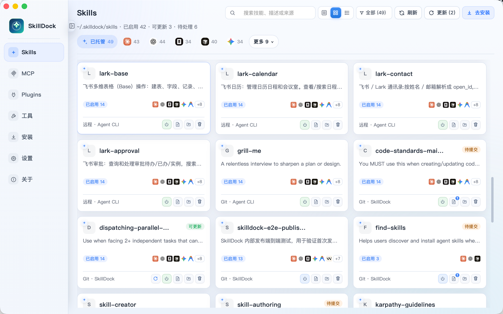
</p>

## What It Does

SkillDock is an AI coding skills manager and desktop control center for Claude Code, Cursor, Codex, Windsurf, Gemini CLI, GitHub Copilot, and other AI coding agents. It keeps local Skills, MCP configurations, and plugin bundles visible, editable, and synced. It scans each tool's real Skill directory, shows managed and unmanaged Skills, and lets users preview local changes before updating or pushing.

The core workflow is team collaboration without intermediate handoff directories. Publishers can modify skills or plugins locally and push changes back with one click; users can update with one click while seeing who updated the package and what changed.

- **Skills library** — Install, update, delete, edit, inspect, and sync local skills.
- **MCP management** — Browse, import, edit, enable, disable, sync, and inspect MCP server configs.
- **Plugin management** — Install, enable, disable, inspect, one-click update, and remove plugin packages, with local change and pending-push detection for Git-backed plugins.
- **Per-tool Skill management** — Inspect and manage the Skills actually used by Claude Code, Cursor, Codex, and other tools; identify managed, unmanaged, and conflicting entries; import unmanaged Skills into SkillDock or remove them from the current tool.
- **Skill diff and collaboration** — Review staged and unstaged diffs and incoming updates, and revert individual files or hunks.
- **Cards and dark mode** — Switch Skills, MCP, and Plugins between list and card layouts, with light, dark, and system themes.
- **MCP tools discovery** — Detect exposed MCP tools, track whether each server config is usable, and control tool-level enablement.
- **Skill install** — Install skills with one click from `skills.sh` and ClawHub, or add them from Git repositories and local folders.
- **MCP install** — Install MCP servers with one click from `MCP.Directory`, then manage their shared configuration lifecycle.
- **Plugin install** — Install plugin packages with one click from Git repositories and enable their bundled skills, commands, agents, and integrations.
- **Complete Git workflow** — Keep Git-based skills and plugins as real repositories, detect upstream updates, local edits, and pending pushes, and preview changes before updating or pushing.
- **One-click multi-tool sync** — Enable skills, MCP servers, and plugins across Claude Code, Codex, Cursor, Windsurf, Gemini CLI, OpenCode, and other coding tools to avoid hand-copying files and editing complex config files.

## Skills

View every installed skill by source group or by the tool's real directory, filter by management status, inspect source metadata, and see Git collaboration state at a glance.

**Skills list**

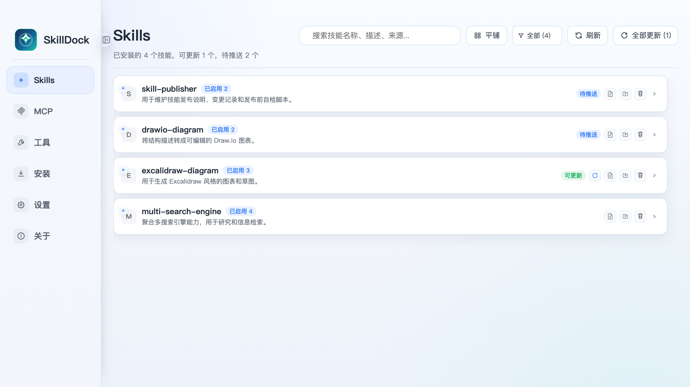

**Skills grouped by source**

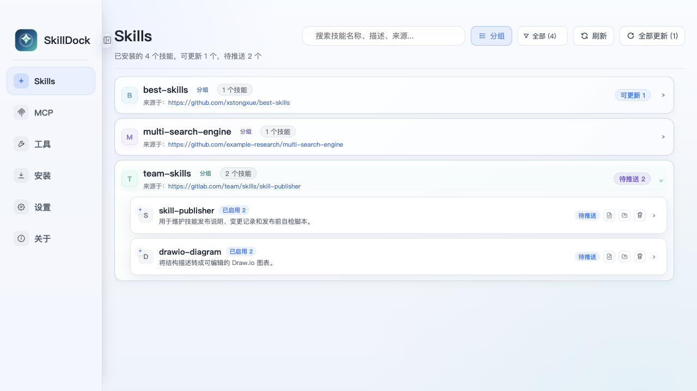

**Skill details and tool sync**

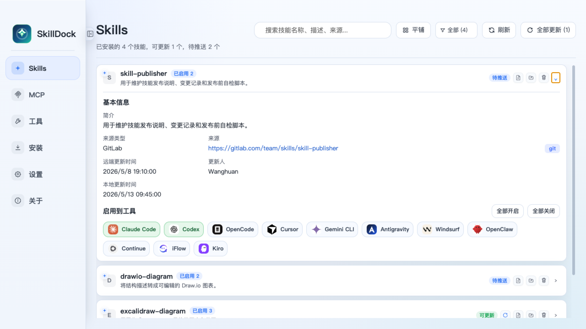

SkillDock preserves source information and tool enablement per skill, so a team-maintained skill can stay connected to its upstream repository while still being applied selectively to Claude Code, Codex, Cursor, Gemini CLI, Windsurf, and other tools.

## MCP

Manage MCP servers in the same workspace as skills. SkillDock scans supported app config files, shows the server command and source, and lets you enable or disable server sync per tool. Use list or card views and inspect MCP tools in context.

**MCP list**

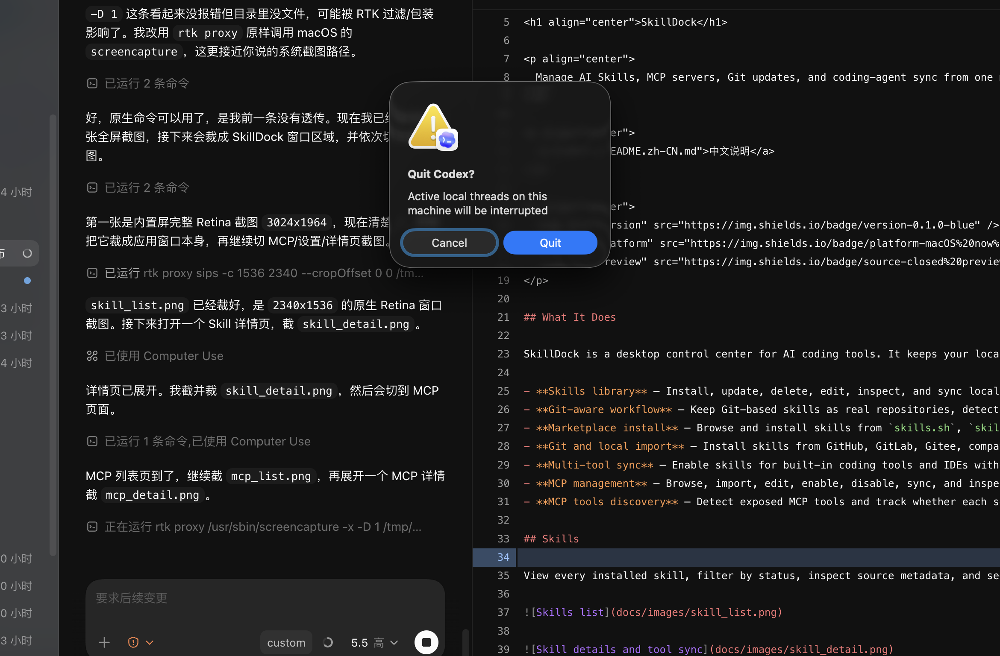

**MCP server details and tools**

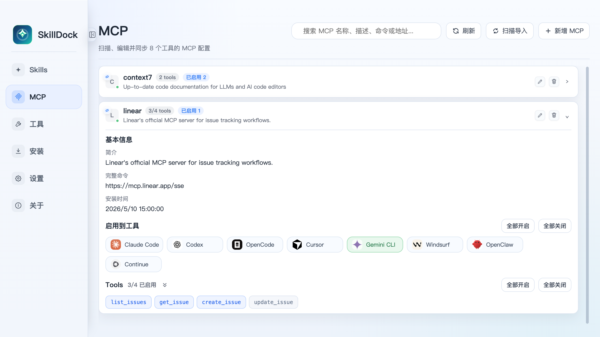

## Plugins

View installed plugins by supported host tool, inspect source metadata, see bundled skills, agents, commands, and host integrations, and track one-click updates, local changes, and pending pushes at a glance.

**Plugin list**

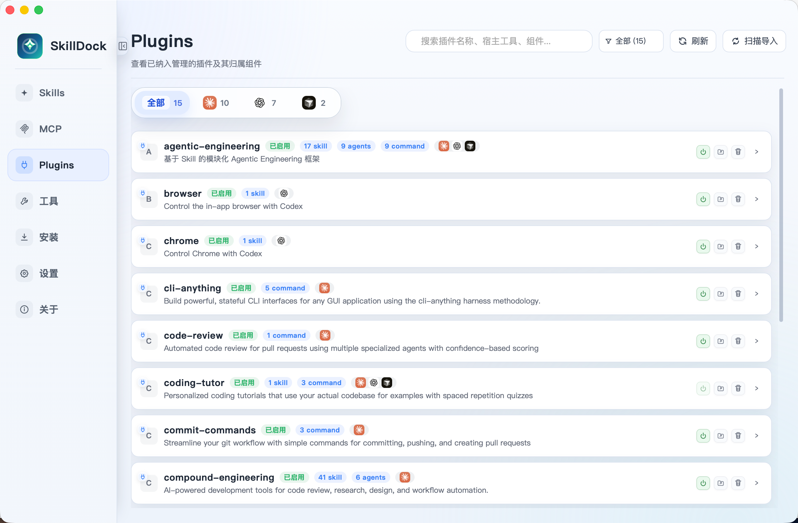

**Plugin details**

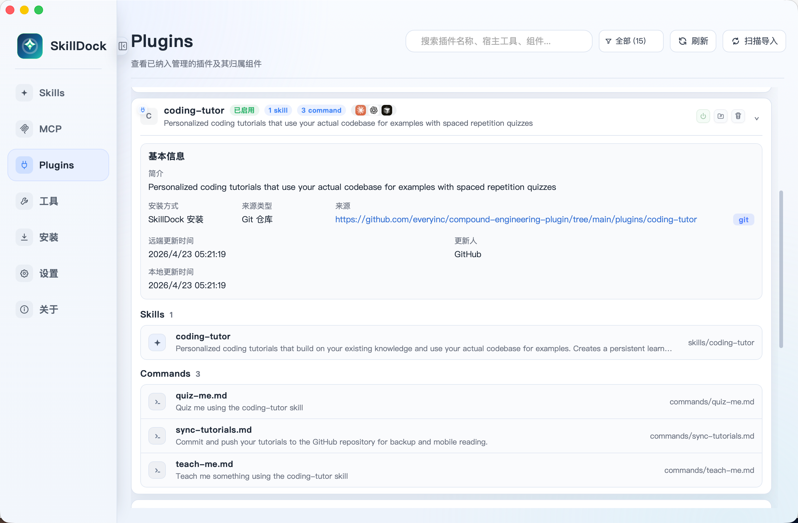

## Tools

SkillDock detects supported coding tools, shows their skill and MCP config locations, and gives you one place to manage sync targets.

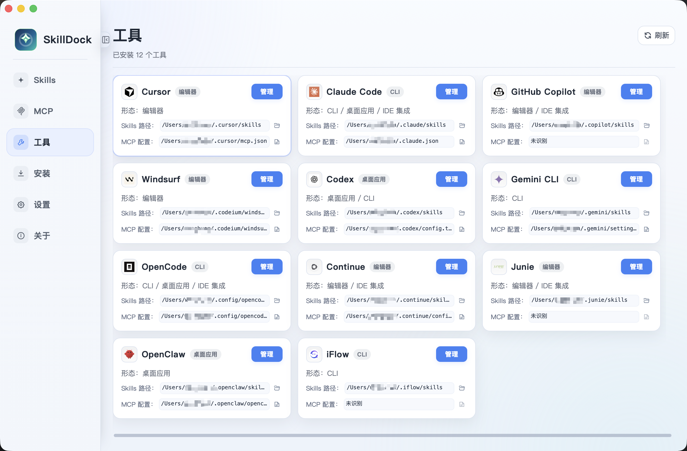

## Install

Install flows are split by package type so skills, MCP servers, and plugins can each follow their own lifecycle.

### Skill install

Install skills with one click from `skills.sh` and ClawHub, or add them from Git repositories and local folders.

**Skill marketplace install**

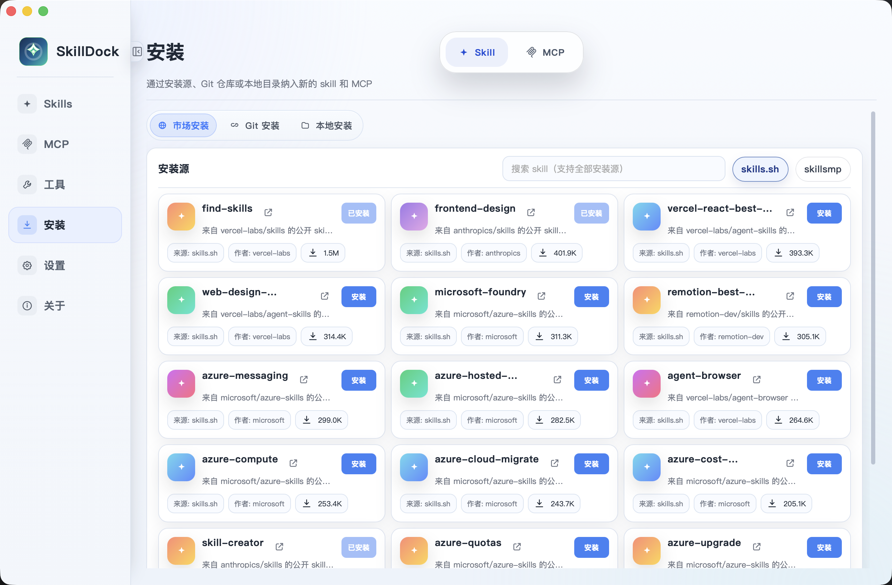

**Skill Git and local install**

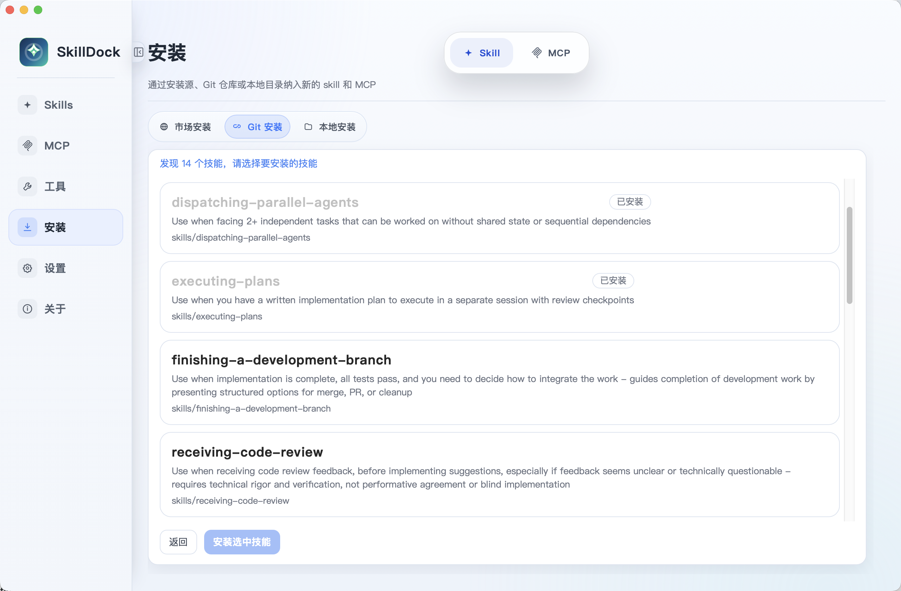

### MCP install

Install MCP servers with one click from `MCP.Directory`, then manage their shared configuration and tools lifecycle.

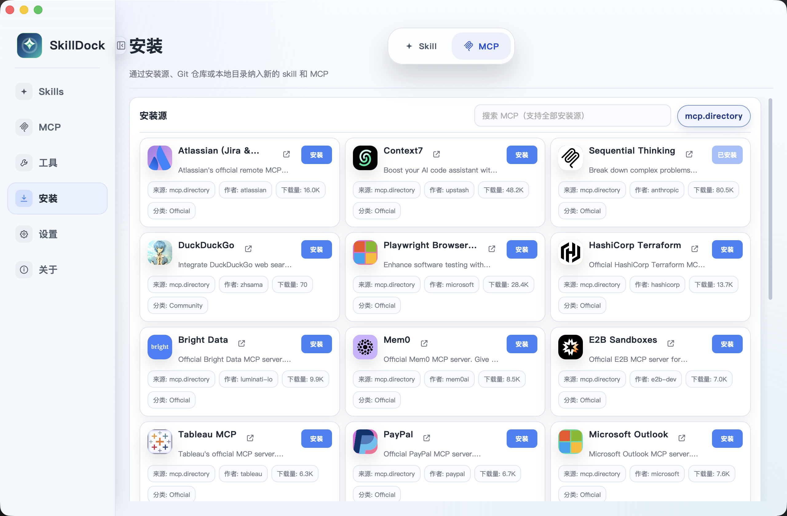

### Plugin install

Install complete plugin packages with one click from Git repositories, select supported host tools, and enable bundled skills, commands, agents, and integrations.

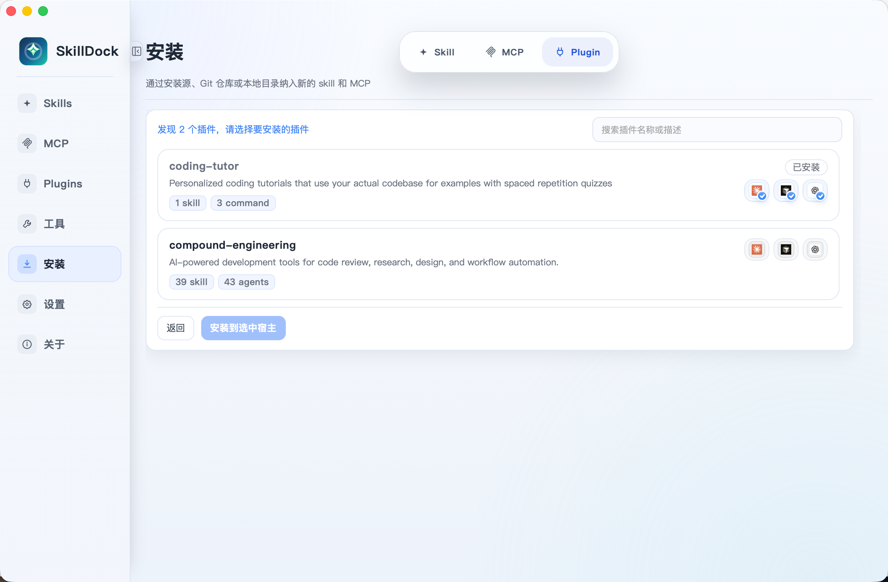

## Settings

Configure the app storage directory, default editor, update checks, default install behavior, themes, card layout preferences, and tool support status.

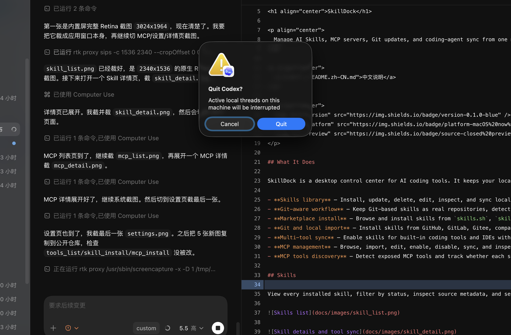

## Supported Tools

Claude Code · Codex · Cursor · Windsurf · IntelliJ IDEA · OpenCode · Gemini · Antigravity · Continue · GitHub Copilot · Qwen Code · Trae · Trae CN · Cline · Roo Code · Kilo Code · Kiro · Goose · Junie · Augment · CodeBuddy · Droid · OpenClaw · CommandCode · Crush · Qoder · Zencoder · Hermes · iFlow · Pi · OMP · Grok Build · MiMo Code · WorkBuddy

## How It Works

Plugins are managed as higher-level packages. A plugin can expose skills, agents, commands, MCP integrations, and host-specific capabilities; SkillDock installs the package once, tracks its source, and lets you enable or disable it for compatible host tools.

MCP servers use a different model: SkillDock manages them as shared configuration records and writes the enabled servers into each tool's MCP config file.

### Agent Skills CLI Compatibility

Turn on **Settings → Agent Skills CLI Compatibility** to scan `~/.agents/skills` and automatically recognize Skills installed globally with `npx skills add ... -g`. They remain managed by Agent Skills CLI and are not moved or copied into `~/.skilldock/skills`; SkillDock can inspect and distribute them, with preview, update, and removal where Agent Skills CLI supports those operations.

Skills installed by SkillDock still live in `~/.skilldock/skills`. Turning compatibility off only stops the extra scan—it does not modify or delete anything in `~/.agents/skills`.

If you prefer the command line, use Agent Skills CLI as the CLI entry point for Skills and SkillDock as the desktop management app: install and maintain `~/.agents/skills` through the CLI, then use SkillDock to inspect them visually, preview updates, and distribute them across tools without changing your existing CLI workflow.

### Skill Management and Workflow

“Managed” identifies where a Skill's real files live and who owns its update and removal lifecycle. “Enabled” means linking a managed Skill into Cursor, Claude Code, Codex, or another tool. Only managed Skills can be distributed centrally: the copy in the managed library is the single distribution source and can be enabled in multiple tools through symlinks.

Skills already stored in a tool's local directory can first be imported into SkillDock for management, then centrally managed and distributed to other tools.

<p align="center">
  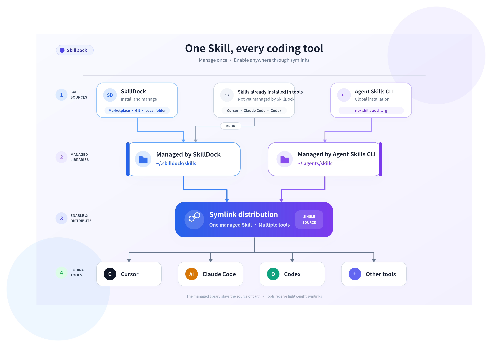
</p>

| How it enters SkillDock | Managed location | Available after management |
| --- | --- | --- |
| Installed from the SkillDock marketplace, Git, or a local folder | `~/.skilldock/skills` | Inspect, edit, remove, and distribute to multiple tools; Git sources also support update checks, Diff previews, and pushes |
| Installed globally with Agent Skills CLI, such as `npx skills add ... -g` | `~/.agents/skills` | Automatically detected after compatibility is enabled; inspect and distribute it, with preview, update, and removal where Agent Skills CLI supports them |
| Already present in Cursor, Claude Code, Codex, or another tool | Copied to `~/.skilldock/skills` after import | Shown as unmanaged before import; after import SkillDock manages it and can enable it in other tools |

## Download

Download the latest [SkillDock release](https://github.com/wanghuan9/skilldock/releases/latest).

| Platform | Status |
| --- | --- |
| macOS Apple Silicon | Released |
| Windows x64 | Released |

### Open the Unnotarized App

SkillDock is not currently notarized by Apple, so macOS may prevent it from opening. After installation, run:

```bash
sudo xattr -cr /Applications/SkillDock.app
```

You can then launch SkillDock normally.

## Getting Started

1. Download and open SkillDock.
2. Install plugins, skills, or MCP servers from a marketplace, Git repository, or local folder.
3. Inspect the real Skill directories used by Claude Code, Cursor, Codex, and other tools.
4. Enable plugins, skills, and MCP servers for your coding tools.
5. Use Git-aware status to review updates, local edits, Diff previews, and push previews.

## Roadmap

- [ ] Public source release after the preview stabilizes.
- [ ] Clearer skill states: updateable, locally modified, pending push, conflicted.
- [ ] Fuller plugin and MCP lifecycle: install, configure, discover tools, and sync across tools.
- [ ] Better Git flows: branch selection, team repository pushback, PR/MR handoff.

## Open Source Plan

SkillDock is currently distributed as a public desktop app preview, but the source code is not open-sourced yet.

We plan to open source the project after the core features, documentation, and release workflow become more stable. Until an official open-source license is published in this repository, the source code and application assets remain proprietary and may not be copied, modified, redistributed, or reverse engineered without permission.
