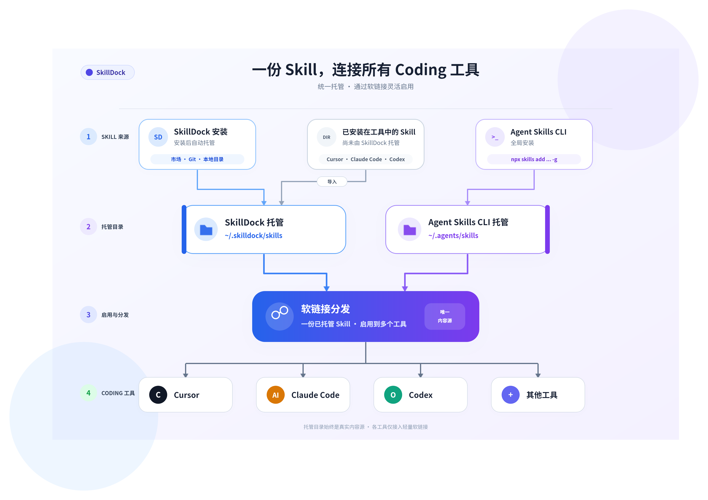

<p align="center">
  
</p>

<h1 align="center">SkillDock - Claude Code、Cursor、Codex 的 AI Skill 管理软件</h1>

<p align="center">
  SkillDock 是面向 Claude Code、Cursor、Codex 等 AI Coding 工具的桌面 Skill 管理软件和 AI Skill Manager，支持安装、查看、编辑、整理、同步和更新 Skills、MCP servers 与插件包，并提供 Git-aware 更新能力，用于跟踪上游变更和本地修改。
</p>

<p align="center">
  <a href="./README.md">English</a> · <a href="#下载">下载</a> · <a href="./docs/install-troubleshooting.zh-CN.md">安装失败？</a>
</p>

<p align="center">
  
  
  
</p>

<p align="center">
  
</p>

## 它能做什么

SkillDock 是一款 AI Skill 管理工具和桌面管理台，面向 Claude Code、Cursor、Codex、Windsurf、Gemini CLI、GitHub Copilot 等 AI Coding Agent。它集中展示、编辑和同步本地 Skills、MCP 配置和插件包，并直接扫描各工具真实 Skill 目录，识别已托管、未托管和冲突状态。对于 Git 来源的 Skills 和插件，它会检测远端更新、本地修改和待推送状态，并支持带 Diff 预览的一键更新。

核心是面向团队协作的直连工作流，不需要中转目录。发布者本地修改 skills 或插件后可以一键推送回仓库；使用者可以一键更新，并看到更新人和更新内容。

- **Skills 管理** — 安装、更新、删除、编辑、查看和同步本地 skills。
- **MCP 管理** — 浏览、导入、编辑、启用、停用、同步和查看 MCP server 配置。
- **插件管理** — 安装、启用、停用、查看、一键更新和删除插件包，并为 Git 来源插件检测本地修改和待推送状态。
- **各软件 Skill 目录管理** — 直接查看并管理 Claude Code、Cursor、Codex 等软件实际使用的 Skill，识别已托管、未托管和冲突状态；支持将未托管 Skill 导入 SkillDock，或从当前软件中移除。
- **Skill Diff 与协作** — 查看已暂存/未暂存 Diff 和远端更新内容，并支持按文件或变更块回退。
- **卡片布局与深色主题** — Skills、MCP 和 Plugins 支持列表/卡片切换，并支持浅色、深色和跟随系统。
- **MCP tools 探测** — 探测 MCP server 暴露的 tools，追踪配置是否可用，并支持 tools 级别的启用和停用控制。
- **Skill 安装** — 支持从 `skills.sh`、ClawHub 市场一键安装，也支持 Git 仓库安装、本地导入及安装。
- **MCP 安装** — 支持从 `MCP.Directory` 市场一键安装 MCP servers，并纳入共享 MCP 配置生命周期。
- **Plugin 安装** — 支持从 Git 仓库一键安装 plugins，并启用其中包含的 skills、commands、agents 和集成能力。
- **完整 Git 工作流** — Git 来源的 skills 和插件会保留为真实仓库，支持远端更新检测、本地修改检测、待推送状态，以及更新和推送前预览。
- **多工具一键同步** — 将 skills、MCP servers 和插件启用到 Claude Code、Codex、Cursor、Windsurf、Gemini CLI、OpenCode 等常用 Coding 工具，避免手动复制和修改复杂配置文件。

## Skill 托管与工作流程

“托管”表示 Skill 的真实目录及其更新、删除由谁管理；“启用”表示将已托管 Skill 通过软链接接入 Cursor、Claude Code、Codex 等工具。只有已托管的 Skill 才能统一分发；每个已托管 Skill 都以托管目录中的一份真实内容作为分发源，可通过软链接同时启用到多个工具。

已存在于各软件本地目录中的 Skill，可先导入 SkillDock 托管，再统一分发到其他工具并集中管理。

<p align="center">
  
</p>

| 进入方式 | 托管目录 | 托管后支持 |
| --- | --- | --- |
| 通过 SkillDock 市场、Git 或本地目录安装 | `~/.skilldock/skills` | 查看、编辑、删除和多工具分发；Git 来源还支持更新检测、Diff 预览及推送 |
| 通过 Agent Skills CLI 全局安装，例如 `npx skills add ... -g` | `~/.agents/skills` | 开启兼容模式后自动识别；支持查看和多工具分发，并在 Agent Skills CLI 支持范围内预览、更新和删除 |
| 已存在于 Cursor、Claude Code、Codex 等工具目录 | 导入后复制到 `~/.skilldock/skills` | 导入前显示为未托管；导入后由 SkillDock 托管，可统一管理并启用到其他工具 |

### 兼容 Agent Skills CLI

在 **设置 → 兼容 Agent Skills CLI** 中开启兼容模式后，SkillDock 会额外扫描 `~/.agents/skills`，自动识别通过 `npx skills add ... -g` 全局安装的 Skill。它们仍由 Agent Skills CLI 托管，不会迁移或复制到 `~/.skilldock/skills`；你可以在 SkillDock 中统一查看并分发到其他工具，并在 Agent Skills CLI 支持范围内预览、更新和删除。

SkillDock 自己安装的 Skill 仍保存在 `~/.skilldock/skills`。关闭兼容模式只会停止扫描，不会修改或删除 `~/.agents/skills` 中的内容。

对于习惯命令行的用户，可以将 Agent Skills CLI 作为 Skill 的命令行入口，将 SkillDock 作为桌面管理端：通过 CLI 安装和维护 `~/.agents/skills`，再通过 SkillDock 可视化查看、预览更新并统一分发到多个工具，无需改变原有 CLI 工作流。

## Skills

查看所有已安装 Skill，按托管库或工具真实目录分组，按状态筛选，检查来源信息，并一眼看到 Git 协作状态。

**Skills 列表**


**按来源分组展示 Skills**


**Skill 详情和工具同步**


SkillDock 会保留每个 skill 的来源和工具启用状态。团队维护的 skill 可以继续关联上游仓库，同时按需同步到 Claude Code、Codex、Cursor、Gemini CLI、Windsurf 等工具。

## MCP

MCP server 和 Skills 放在同一个工作台中管理。SkillDock 会扫描受支持应用的配置文件，展示 server 命令、来源和 tools，并允许按工具启用或停用同步；同时支持列表和卡片布局。

**MCP 列表**


**MCP 详情和 tools**


## Plugins

查看已安装插件，按宿主工具筛选，检查来源信息，并一眼看到其中包含的 skills、agents、commands、宿主集成能力、一键更新、本地修改和待推送状态。

**插件列表**


**插件详情**


## 工具

SkillDock 会检测受支持的 Coding 工具，展示每个工具的 Skills 路径和 MCP 配置路径，并集中管理同步目标。


## 安装

安装流程按类型拆分，Skill、MCP server 和 Plugin 都可以按各自生命周期安装和管理。

### Skill 安装

支持从 `skills.sh`、ClawHub 市场一键安装，也支持 Git 仓库安装、本地导入及安装。

**Skill 市场安装**


**Skill Git 仓库安装和本地导入**


### MCP 安装

支持从 `MCP.Directory` 市场一键安装 MCP servers，并管理共享 MCP 配置与 tools 生命周期。


### Plugin 安装

支持从 Git 仓库一键安装完整插件包，选择支持的宿主工具，并启用其中包含的 skills、commands、agents 和集成能力。


## 设置

配置应用存储目录、默认编辑器、更新检查、默认安装行为、主题、卡片布局偏好和工具支持状态。


## 支持的工具

Claude Code · Codex · Cursor · Windsurf · IntelliJ IDEA · OpenCode · Gemini · Antigravity · Continue · GitHub Copilot · Qwen Code · Trae · Trae CN · Cline · Roo Code · Kilo Code · Kiro · Goose · Junie · Augment · CodeBuddy · Droid · OpenClaw · CommandCode · Crush · Qoder · Zencoder · Hermes · iFlow · Pi · OMP · Grok Build · MiMo Code · WorkBuddy

## 工作机制

插件会作为更高层级的包来管理。一个插件可以暴露 skills、agents、commands、MCP 集成和宿主专属能力；SkillDock
会统一安装插件包、追踪来源，并允许你为兼容的宿主工具启用或停用。

MCP servers 使用的是另一套机制：SkillDock 会把它们作为统一配置记录管理，并在启用时写入对应工具的 MCP 配置文件。

## 下载

前往 [SkillDock 最新版本](https://github.com/wanghuan9/skilldock/releases/latest) 下载安装包。

| 平台 | 状态 |
| --- | --- |
| macOS Apple Silicon | 已发布 |
| Windows x64 | 已发布 |

### 未公证应用放行

SkillDock 目前未经过 Apple 公证，macOS 可能会阻止打开。安装后在终端执行：

```bash
sudo xattr -cr /Applications/SkillDock.app
```

之后即可正常启动。

## 快速开始

1. 下载并打开 SkillDock。
2. 从市场、Git 仓库或本地目录安装 Plugins、Skills 或 MCP servers。
3. 查看 Claude Code、Cursor、Codex 等工具实际使用的 Skill 目录。
4. 为你的 Coding Agent 启用 Plugins、Skills 和 MCP servers。
5. 使用 Git-aware 状态查看更新、本地修改、Diff 预览和推送预览。

## 路线图

- [ ] 预览版稳定后开放源码。
- [ ] 更清晰的 skill 状态：可更新、本地已修改、待推送、冲突。
- [ ] 更完整的插件和 MCP 生命周期：安装、参数配置、tools 探测、跨工具同步。
- [ ] 更好的 Git 流程：分支选择、团队仓库回推、PR/MR 交接。

## 开源计划

SkillDock 目前会先以公开桌面应用预览版的形式发布，源码暂未开源。

我们计划在核心功能、文档和发布流程更加稳定后，将项目开源。在本仓库正式发布开源许可证之前，源码和应用资源仍保留所有权利，未经授权不得复制、修改、分发或反向工程。
